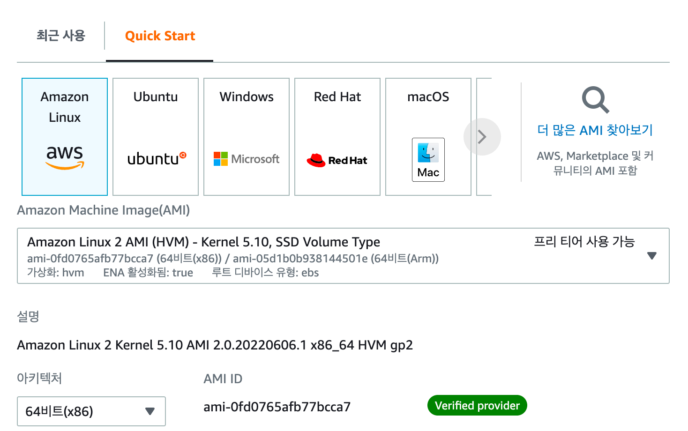
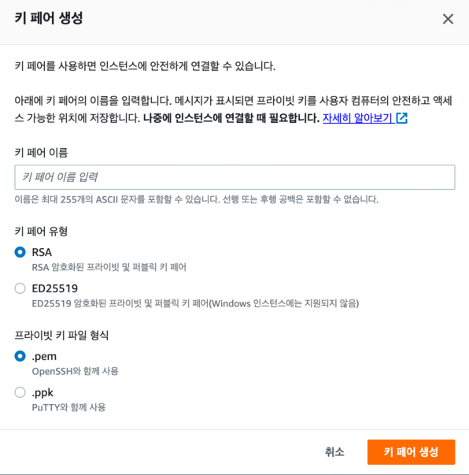
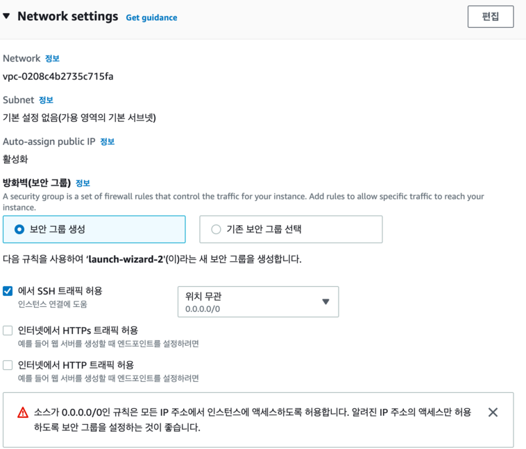
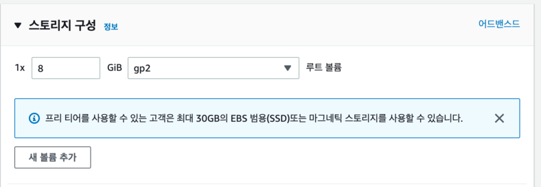
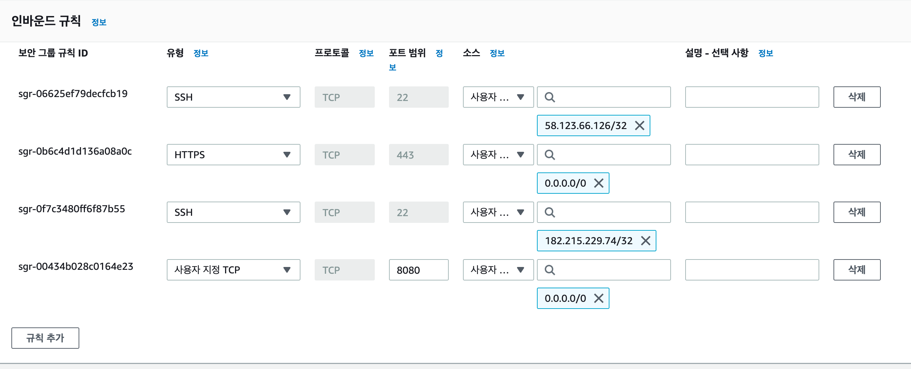
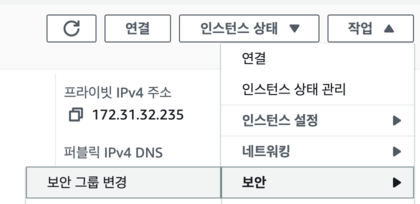

# AWS EC2 인스턴스 생성하기
## 소개
### EC2(Elastic Compute Cloud)

AWS에서 무료료 제공하는 프리티어 플랜에서는 EC2사용에 다음과 같은 제한이 있다.
* 사양이 t2.micro만 가능
  * vCPI(가상 CPU) 1 Core, 메모리 1GB
  * 보통 vCPU는 물리 CPU사양의 절반 정도의 성능을 가짐

- 월 750시간의 제한이 있으며 초과하면 비용이 부과됨 
  - 24시간 * 31일 = 744시간 
  - 즉, 1대의 t2.micro만 사용한다면 24시간 켜놔도 요금이 부과되지 않음

- 리전(Region)
  - 리전이란 AWS의 서비스가 구동될 지역을 이야기한다. AWS는 도시별로 클라우드 센터를 지어 해당 센터에서 구축된 가상머신들을 사용할 수 있다. 
  - 국내에서 서비스한다면 서울 리전을 선택해야 네트워크가 가장 빠르다.

## 인스턴스 시작
### AMI(Amazon Machin Image, 아마존 머신 이미지) 선택
1. AMI는 EC2 인스턴스를 시작하는 데 필요한 정보를 이미지로 만들어 둔 것
2. Quick Start탭에서 아마존 리눅스 2를 선택(아마존이 개발하고 있기 때문에 지원받기 용이하고 AWS의 각종 서비스와 상성이 좋다는 장점), 자동으로 프리티어에 플랜에서 지원하는 인스턴스 유형(t2.micro)로 선택됨  

> 인스턴스 유형 중 t2는 요금 타입을 이야기하며, micro는 사양을 이야기한다. t2외에 t3도 있으며 이들을 보통 T시리즈라고 한다.T시리즈는 범용 시리즈라고 불리기도 하는데 다른 시리즈와 달리 nano, micro등 저사양이 존재하기 때문이다.이들은 크레딧이란 일종의 CPU를 사용할 수 있는 포인트 개념이 있다. 인스턴스 크기에 따라 정해진 비율로 CPU 크레딧을 계속 받게 되며, 사용하지 않을 때는 크레딧을 축적하고, 사용할 때 크레딧을 사용한다.  
정해진 사양보다 더 높은 트래픽이 오면 크레딧을 좀 더 적극적으로 사용하면서 트래픽을 처리하지만, **크레딧이 모두 사용되면 더이상 EC2를 사용할 수 없다.** 따라서, 트래픽이 높은 서비스들을 T시리즈를 쓰지 않고 다른 시리즈를 사용하기도 한다. 다만, 그전까지는 활용도가 높기 때문에 시작하는 단계에서는 좋은 선택이다.  

### 세부정보 구성

#### 키 페어(로그인)

- 인스턴스로 접근하기 위해서는 pem키(비밀키)가 필요하다. 인스턴스는 지정된 pem 키(비밀키)와 매칭되는 공개키를 가지고 있어, 해당 pem키 외에는 접근을 허용하지 않는다.
- 일종의 마스터키이기 때문에 절대 유출하면 안 된다. pem 키는 이후 EC2 서버로 접속할 때 필수 파일이니 잘 관리할 수 있는 디렉토리로 저장한다.
- 기존에 생성된 pem 키가 있다면 선택하고 없다면 신규로 생성한다.

#### 네트워크 세팅

기업에서 사용할 경우 화면상에 표기된 VPC, 서브넷 등을 세세하게 다루지만, 지금 단계에서는 기본값을 그대로 가져가면 된다.

#### 스토리지 구성

스토리지는 흔히 **하드디스크**라고 부르는 서버의 디스크(SSD도 포함)를 이야기 하며 **서버의 용량**을 얼마나 정할지 선택하는 단계다.  
기본값이 8GB인데 **최대 30GB까지 프리티어 플랜으로 가능**하다. 최대치인 30GB로 변경하자

#### 보안 그룹 추가
네트워크 및 보안 > 보안 그룹
- AWS에서 보안 그룹은 방화벽을 이야기한다.
  - 인바운드: 서버 내부로 들어오는 것 
  - 아웃바운드: 서버 바깥으로 나가는 것
- 인바운드 규칙정도만 신경쓰면 되는데, 유형 항목이 SSH 이고 포트가 22번인 경우 **지정된 IP에서만 ssh 접속이 가능하도록 구성하는 것이 안전**하다.  
추가로, 프로젝트의 기본 포트(사용할 기술인 Spring Boot 기준)인 8080 포트와 HTTPS 프로토콜 정도를 열어놓았다.

- 보안 그룹을 생성했다면 인스턴스 대시보드로 돌아가 생성한 보안그룹으로 변경해준다.

## 마무리
- 인스턴스도 결국 하나의 서버이기 떄문에 IP가 존재한다. 인스턴스 생성 시에 항상 새 IP를 할당하는데, 문제는 EC2인스턴스를 중지하고 **다시 시작할 때도 새 IP가 할당**된다.
- 매번 변경되지 않는 고정 IP를 할당하면 좋다. AWS의 고정 IP를 **Elastic IP(EIP, 탄력적 IP)**라고 한다. EC2 인스턴스 페이지의 왼쪽 카테고리에서 탄력적 IP를 눌러 선택하고 새 주소 할당 버튼을 클릭해서 할당받아 적용하자
