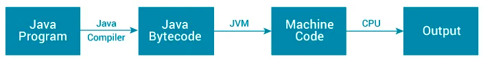
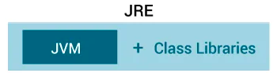
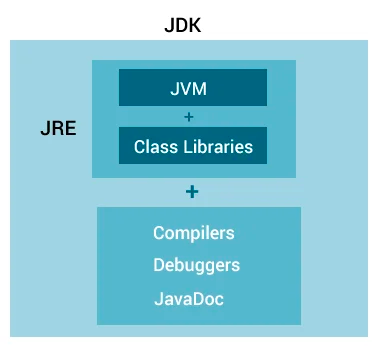
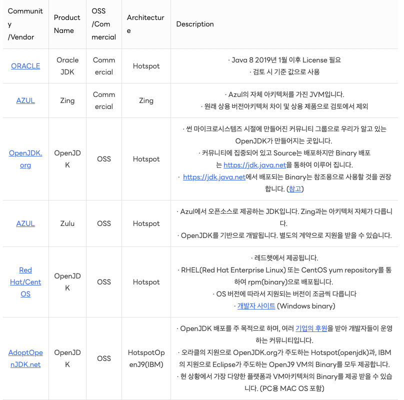

자바를 학습하며 헷갈리는 용어들을 정리해보았습니다.

## What is JVM?
`JVM(Java Virtual Machine)`은 컴퓨터에서 자바를 실행하기 위한 가상 머신입니다.

자바 프로그램을 실행할 때 자바 컴파일러는 먼저 자바 코드를 바이트 코드로 컴파일합니다. 그런 다음 JVM은 바이트 코드를 기계어(set of instructions that a computer's CPU executes directly)로 변환합니다.
자바로 작성된 애플리케이션은 모두 이 가상 머신(JVM)에서만 실행되기 때문에, 자바 애플리케이션이 실행되기 위해서는 반드시 JVM이 필요합니다.

일반 애플리케이션은 OS마다 다른 컴파일러가 필요하지만, 자바는 OS와 바로 맞붙어 있지 않고 JVM하고만 상호작용을 하기 때문에 OS에 독립적인 언어입니다.  
단, JVM은 OS에 종속적이기 때문에 해당 OS에서 실행가능한 JVM이 필요합니다.

> JVM은 Java 뿐만 아니라, Groovy 나 Scala, Clojure 그리고 Kotlin 같은 언어에서도 사용합니다.

결국 JVM은 **자바로 짜서 컴파일한 소프트웨어들 JVM이 깔린 어떤 종류의 컴퓨터에서든 돌 수 있게 해주는것** 이라고 정리할 수 있습니다. 
이렇게 함으로써 자바의 원칙인 `WORA(Write once run anywhere)` 이 가능하게 되는것입니다.

## What is JRE?
`JRE(Java Runtime Environment)`는 Java 응용 프로그램을 실행하는 데 필요한 Java 클래스 라이브러리, **JVM(Java Virtual Machine) 및 기타 구성 요소**를 제공하는 소프트웨어 패키지입니다.
소프트웨어는 딱 우리가 작성한 자바 코드만으로 돌아갈 수 있는 것은 아닙니다.

예를 들어 자바의 자료구조 기능들인 List, Map 그리고 Set과 같은 기능들을 사용할 수 있는 이유는 그런 기능들을 일일이 다 구현했기 때문이 아니라
그것들이 바이트코드로 컴파일된 클래스로 제공되었기 때문입니다.

즉 JRE는 JVM의 실행환경을 구현한 것이라고 표현할 수 있겠네요(포함관계: JDK < JRE)

## What is JDK?
`JDK(Java Development Kit)`는 Java로 애플리케이션을 개발하는 데 필요한 소프트웨어 개발 키트입니다. JDK를 다운로드하면 JRE도 함께 다운로드됩니다.  
JRE 외에도 JDK에는 여러 개발 도구(컴파일러, JavaDoc, Java 디버거 등)도 포함되어 있습다. (포함관계: JVM < JRE < JDK)

> **자바의 버전 = JDK의 버전**  
> - 자바란 언어 자체는 무료이며, JDK중에서 오라클에서 배포하는 Oracle JDK의 경우 상업적 이용에 한해서 유료입니다.  
> - Open JDK를 사용하면 모두 무료로 이용할 수 있으며 아래 표는 각 배급처에서 배포하는 OpenJDK 배포 버전의 종류를 정리한 내용입니다.(출처: [LINE의 OpenJDK 적용기: 호환성 확인부터 주의 사항까지](https://engineering.linecorp.com/ko/blog/line-open-jdk/))
> 

✔️ JDK에는 **버전**이 있고, 각 버전별로 새로운 기능이 추가되거나 기존 기능이 사라질 수 있습니다.  
✔️ JDK에는 **종류**가 있고, 기능 자체는 모두 동일하나 성능과 비용에 약간의 차이가 있을 수 있습니다.
 
## 참고
https://www.programiz.com/java-programming/jvm-jre-jdk  
자바의 정석 3판
