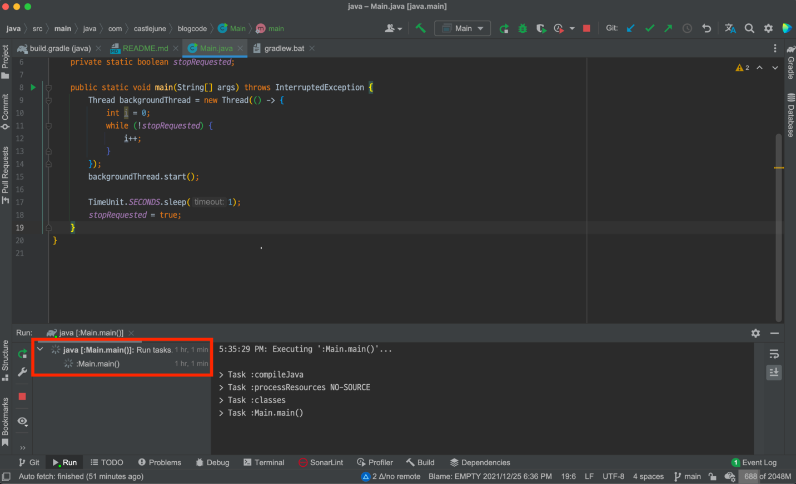
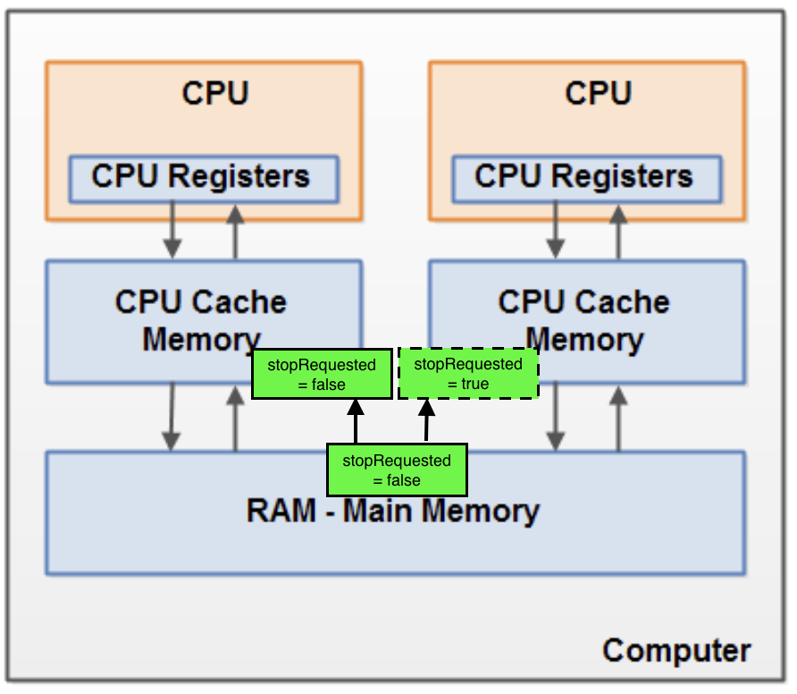
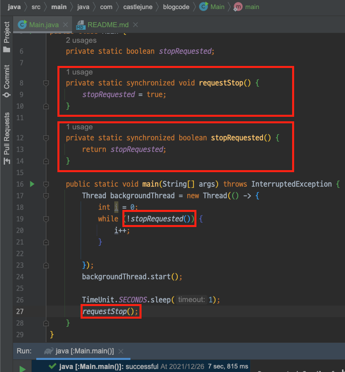
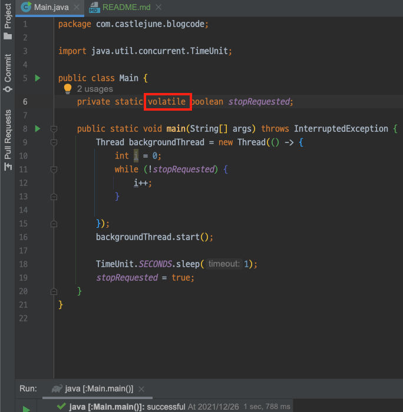
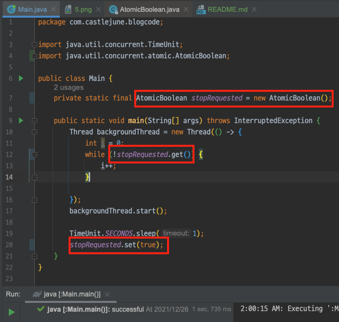

# 동기화(synchronization)와 Thread Safe 제대로 이해하기

싱글스레드 프로세스의 경우 프로세스 내에서 단 하나의 스레드만 작업하기 때문에 프로세스의 자원을 가지고 작업하는데 별문제가 없지만,  
멀티스레드 프로세스의 경우 여러 스레드가 같은 프로세스 내의 자원을 공유해서 작업하기 때문에 서로의 작업에 영향을 주게 됩니다. 

> 한 스레드가 진행 중인 작업을 다른 스레드가 간섭하지 못하도록 막는 것을 '스레드의 동기화(synchronization)'라고 합니다. 

자바의 **synchronized** 키워드를 이용하면 해당 메서드나 블록을 한번에 한 스레드씩 수행하도록 보장합니다.  
다시 말해서 스레드의 **배타적 실행**을 보장합니다. 여기까지는 알고 있었던 동기화에 대한 개념이었습니다. 

그러나 이펙티브 자바(Effective Java)의 아이템 78을 읽다보면 이런 내용이 나옵니다. 
- 동기화에는 중요한 기능이 하나 더 있다. 동기화 없이는 한 스레드가 만든 변화를 다른 스레드에서 확인하지 못할 수 있다.
- 동기화는 일관성이 깨진 상태를 볼 수 없게 하는 것은 물론, 동기화된 메서드나 블록에 들어간 스레드가 같은 락에 보호하에 수행된 모든 이전 수정의 최종 결과를 보게 해준다.
- 동기화는 배타적 실행뿐 아니라 스레드 사이의 안정적인 통신에 꼭 필요하다.

무슨 내용인지 책을 보면서 이해가 잘 안되었는데요.. 예제 코드와 함께 알아보겠습니다. 

## 예제
```java
public class StopThread {
    private static boolean Main;

    public static void main(String[] args) throws InterruptedException {
        Thread backgroundThread = new Thread(() -> {
            int i = 0;
            while (!stopRequested) {
                i++;
            }
        });
        backgroundThread.start();

        TimeUnit.SECONDS.sleep(1);
        stopRequested = true;
    }
}
```
결론부터 말하면 위 코드는 동기화 처리를 하지 않아서 종료되지 않는 문제가 있는 코드입니다.  

1초뒤에 공유변수 `stopRequested` 를 `main 스레드`가 `true` 로 바꾸고 `backgroundTread`가 그 값을 가져온다면 종료되어야 맞는데 왜 종료되지 않을까요?  

가령 1초뒤에 Thread간 경합으로 인해서 동기화 처리를 하지 않은 공유변수 stopRequested 의 일관되지 않은 상태를 backgroundTread가 한번쯤 보게 된다고 하더라도 다음 반복때는 변경된 값을 인지해야 하는 것이 아닌가 하는 생각이 들었습니다.

그러나 생각해보면 저의 가정은 애초에 잘못된 가정입니다. 자바 언어 명세상 long과 double 외의 변수를 읽고 쓰는 동작은 **원자적(atomic)** 입니다. ([JLS, 17.7](https://docs.oracle.com/javase/specs/jls/se8/html/jls-17.html#jls-17.7))
> JVM은 데이터를 4byte(=32bit)단위로 처리하기 때문에, int와 int보다 작은 타입들은 한 번에 읽고 쓰는 것이 가능합니다.  
> 즉, 단 하나의 명령어로 읽거나 쓰기가 가능하다는 뜻입니다. 
> 하나의 명령어는 더 이상 나눌 수 없는 최소의 작업단위이므로, 작업의 중간에 다른 스레드가 끼어들 틈이 없습니다.  
> 다만, 크기가 8byte인 long과 double 타입의 변수는 하나의 명령어로 값을 읽거나 쓸수 없기 때문에, 변수의 값을 읽는 과정에 다른 스레드가 끼어들 여지가 있습니다.  
> 
> (출처: 자바의 정석 3판)

그러니 알고 있는 지식으로는 boolean 필드를 읽고 쓰는 작업 자체가 **atomic**하기 때문에 필드에 접근할때 동기화를 안해도 문제가 생기지 않아야 하는데.. 궁금해서 코드를 작성하고 돌려보았습니다.



실제로 돌려보니 1시간이 지나도 코드가 종료되지 않는 것을 확인할 수 있었습니다.

## 문제 원인
> 자바 언어 명세를 보면 스레드가 필드를 읽을 때 '수정이 완벽히 반영된' 값을 얻는다고 보장하지만, 한 스레드가 저장한 값이 다른 스레드에게 '보이는가'는 보장하지 않는다고 되어 있습니다.
> 이는 한 스레드가 만든 변화가 다른 스레드에게 언제 어떻게 보이는지를 규정한 **자바의 메모리 모델** 때문입니다. ([JLS, 17.4](https://docs.oracle.com/javase/specs/jls/se8/html/jls-17.html#jls-17.4))

언급된 메모리 모델과 문제 상황을 그림으로 나타낸 것입니다.  


스레드가 변수를 읽어올 때 Main Memory에 바로 접근하지 않고 CPU Cache 에 데이터가 있다면 캐시에서 읽어오게 됩니다.  
그래서 실제 변수의 값이 변화해도 해당 스레드는 그 전에 읽었던 CPU Cache 에서 읽기 때문에 변경된 사항을 볼 수 없습니다. 

위 코드에서 main 스레드는 stopRequested의 값을 변경시켰지만 backgroundThread는 본인 스레드 CPU Cache에 있는 값을 바라보기 때문에 불일치 문제가 발생합니다.

이러한 문제를 동시성 프로그래밍(Concurrent Programming)에서의 **가시성(Visibility)** 문제라고 합니다.

## 해결 방안 

### 1. 적절한 동기화 처리
포스트 도입부에 이펙티브 자바를 읽다보면 나오는 내용이라며 다음과 같이 언급한 부분이 있습니다. '동기화는 배타적 실행뿐 아니라 스레드 사이의 안정적인 통신에 꼭 필요하다.'  
말 그대로 현재 문제 상황은 스레드 사이의 안정적인 통신에 문제가 있으므로 `synchronized` 키워드를 사용해 동기화 처리를 해보겠습니다.  
(동기화 처리의 원리와 개념에 대해 설명하는 글은 아니므로 `synchronized`에 대한 자세한 설명은 생략하겠습니다.)


스레드가 `synchronized` 블럭으로 들어갈 때와 나올 때, 캐시와 메모리간의 동기화가 이루어지기 때문에 값의 불일치가 해소됩니다.  

이제 앞서 이야기한 동기화가 **배타적 수행**뿐만 아니라 **스레드 간 통신기능**도 수행하는 것이 이해되었습니다!

### 2. volatile 키워드
`synchronized` 블럭의 임계 영역은 멀티스레드 프로그램의 성능을 좌우하기 때문에 가능하면 임계영역을 최소화해서 효율적인 프로그래밍을 해야합니다.  
속도가 더 빠른 대안을 소개하자면 자바에서 `volatile` 이란 한정자로 변수의 읽기와 쓰기를 원자화 할 수 있습니다.  

`volatile` 키워드를 붙이면 해당 변수를 읽어올 때 캐시가 아닌 메모리에서 직접 읽어오게 되는데 그렇기 때문에 스레드 간 안정적인 통신은 보장할 수 있습니다.  


> 주의할 점은 `volatile` 키워드는 변수의 읽기나 쓰기의 원자화를 보장하지만 배타적 수행과는 상관없습니다!

예를 들어 다음은 일련변호를 생성할 의도로 작성한 메서드입니다.
```java
private static volatile int nextSerialNumber = 0;

public static int generateSerialNumber() {
    return nextSerialNumber++;
}
```
이 메서드의 상태는 `nextSerialNumber` 라는 단 하나의 필드로 결정되는데, 원자적으로 접근할 수 있습니다. 따라서 얼핏 보기엔 굳이 동기화하지 않더라도 불변식을 보호할 수 있어 보입니다.  
그러나 `증가연산자(++)`는 코드상으로는 하나의 명령어지만 실제로는 필드에 두 번 접근합니다. 먼저 값을 읽고, 그런 다음 1증가한 새로운 값을 저장합니다.  
만약 두 번째 스레드가 이 두 접근 사이에 들어와 값을 읽어가면 증가한 값이 아닌 첫 번째 스레드와 같은 값을 돌려받게 됩니다.  

따라서 이러한 경우에는 메서드에 `synchronized` 한정자를 붙여서 동시에 호출해도 서로 간섭하지 않도록 배타적 수행도 보장해야 합니다.

결국 동기화를 제대로 하려면 `synchronized` 밖에 없는 것인가.. 라는 생각이 들던 찰나에 책을 더 읽어보니 꽤나 멋진 다른 방법도 소개되어 있었습니다. 

###  3. Atomic 변수(java.util.concurrent.atomic)
멀티쓰레드 환경에서 동기화 문제를 `synchronized` 키워드를 사용하여 락을 걸곤 하는데 이 키워드 없이 동기화문제를 해결하기 위해 고안된 방법입니다.  
`synchronized는` 특정  스레드가 해당 블럭 전체에 락을 걸기때문에 다른 스레드는 아무런 작업을 하지 못하고 기다리는 상황(Blocking)이 될 수 있어서 낭비가 심합니다. 그래서 Non-Blocking 하면서 동기화 문제를 해결하기 위한 방법이 `Atomic`입니다.

`java.util.concurrent.atomic` 패키지에는 락 없이도(lock-free) thread-safe한 프로그래밍을 지원하는 클래스들이 담겨 있습니다. 성능도 더 우수하다고 알려저 있습니다.  
`volatile`은 동기화의 두 효과 중 스레드 간 통신 쪽만 지원하지만 이 패키지는 원자성(배타적 수행)까지 지원합니다. 클래스들을 까보니 내부적으로 `volatile` 키워드를 내포하고 있더군요.  

##### 스레드 간 통신 - 가시성(Visibility) 지원
  

##### 배타적 수행 - 원자성 (Atomicity) 지원
```java
private static final Atomiclong nextSerialNum = new AtomicLong();

public static int generateSerialNumber() {
    return nextSerialNum.getAndIncrement();
}
```

Atomic의 동작 핵심원리는 **CAS알고리즘(Compared and Swap)** 입니다.  
CAS 알고리즘을 어떻게 적용하는지에 대한 내용은 다음 블로그에서 잘 설명해 주는 것 같아 참고하면 좋을 것 같습니다.(https://javaplant.tistory.com/23)

## 마무리
사실 이 포스팅을 하게 된 계기인 **동시성 객체 공유에서 가시성 고려**에 대한 개념은 학교에서 운영체제 과목 멀티쓰레드 프로그래밍을 학습할 때 배웠던 내용입니다. 다시 한번 수업때 더 집중할 걸 하고 반성해봅니다.😅  

포스팅하면서 자바의 동시성 제어 솔루션으로 가장 일반적으로 사용되는 `syncronized`, `volatile`, `atomic` 에 대한 개념도 다시 한번 정리할 수 있는 기회가 되었습니다.

이펙티브 자바의 해당 파트를 마저 읽고 정리한 내용입니다.
- 동기화에 대한 문제를 피하는 가장 좋은 방법은 가변 데이터를 공유하지 않는 것이며 가변 데이터는 단일 스레드에서만 사용하는 것이 좋다.
- 가변 데이터를 단일 스레드에서만 사용한다면 문서에 남겨 유지보수 정책에서도 지켜지는것이 중요하다.
- 멀티 스레드 환경에서 한 스레드가 데이터를 수정한 후에 다른 스레드에 공유할 때는 해당 객체에서 공유하는 부분만 동기화해도 된다.
- 여러 스레드가 가변 데이터를 공유한다면 그 데이터를 읽고 쓰는 메서드 모두에 반드시 `synchronized` 키워드를 붙이거나 가변 데이터에 `atomic` 변수를 사용한다.
- 배타적 실행 (한번에 한스레드) 동작이 필요없고, 스레드 간 최신데이터만 읽는 거로도 충분하면 가변 변수에 `volatile` 키워드만으로도 동기화가 가능하다.