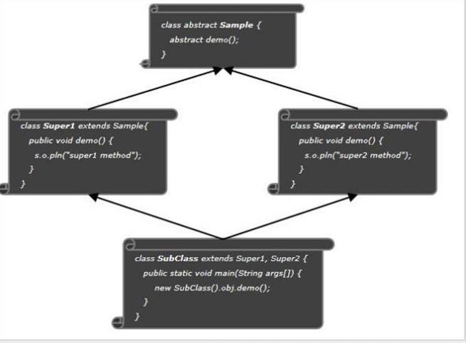

# 자바와 다중상속 문제

다른 객체지향언어인 C++에서는 여러 조상 클래스로부터 상속받는 것이 가능한 **'다중상속(multiple inheritance)'** 을 허용하지만 자바에서는 오직 단일 상속만을 허용합니다. 사실 다중상속 문제는 수년동안 논쟁의 여지가 있는 문제로 다루어져 왔습니다. 지금부터 다중 상속의 가장 대표적인 문제로 꼽히는 **다이아몬드 문제(Diamond Problem)** 을 통해서 그 이유에 대해 살펴보겠습니다.

## The diamond problem
다음과 같이 추상 메서드를 가진 `Sample` 추상 클래스가 있습니다.
```java
public abstract class Sample {
    public abstract void demo();
}
``` 
여기서`Sample` 클래스를 상속받아 `demo` 메서드를 구현하는 두 개의 클래스가 있습니다.
```java
public class Super1 extends Sample {
   public void demo() {
      System.out.println("demo method of super1");
   }
}
```
```java
public class Super2 extends Sample {
   public void demo() {
      System.out.println("demo method of super2");
   }
}
```
자바가 다중상속을 지원한다는 가정하에 `Super1` 및 `Super2` 클래스 모두를 상속받는 자식 클래스를 하나 만들어봅니다.
```java
public class SubClass extends Super1, Super2 {
    
   public static void main(String args[]) {
      SubClass obj = new SubClass();
      obj.demo();
   }
}
```
그럼 여기서 같은 **Method Signature(메서드 이름 + 파라미터 리스트)** 를 가지는 `demo()`가 `Super1`과 `Super2`에 있는데요, 두 클래스 모두를 상속받은 `SubClass` 의 `demo()`를 호출한다면 어떤 부모의 `demo()`를 사용해야 할까요?
어떤 부모의 메서드를 호출해야할지 모호해지는 문제가 발생합니다.(다중상속을 시도하면 컴파일 타임에 오류가 발생합니다.)

이와 같은 문제를 **다이아몬드 문제(the diamond problem)** 라고 부릅니다.
또한 다중상속을 허용하면 클래스의 성질이 복합적으로 섞여 부모와 **IS-A 관계**가 모호해져 정체성이 불분명해져 여러가지 객체지향 원칙에 위배될 수 있습니다. 이러한 이유로 자바는 클래스 다중상속을 지원하지 않습니다.

## default method(Java 8)
자바8에서 매우 중요한 인터페이스의 변경점 두가지 중 하나인 **default method**를 사용하면 자바에서도 다중 상속 개념을 가져갈 수 있습니다. (attribute 의 상속을 제외하면)
> 참고. 자바 인터페이스 변경점 (Java 8~)
> - default method: 인터페이스에서 기본 구현을 갖는 method
> - static method: 클래스에서의 static method와 같이 인터페이스에서의 static method

본래 인터페이스의 추상 메서드들과 달리 디폴트 메서드는 기본 구현이 있는 메서드입니다. 추상 메서드가 아니기 때문에 디폴트 메서드는 자식 클래스에서 **재정의(override)** 해야할 의무는 없습니다.
```java
interface MyInterface1{
   public default void display() {
      System.out.println("display method of MyInterface1");
   }
}
```
```java
interface MyInterface2{
   public default void display() {
      System.out.println("display method of MyInterface2");
   }
}
```
```java
public class InterfaceExample implements MyInterface1, MyInterface2{
   public void display() {
       System.out.println("display method of MyInterface2");
       //or,
       System.out.println("display method of MyInterface2");
   }
   
   public static void main(String args[]) {
      InterfaceExample obj = new InterfaceExample();
      obj.display();
   }
}
```
위와 같이 두 개의 다른 인터페이스에서 동일한 형태의 디폴트 메서드를 가지고 있는 상태에서 자식 클래스에서 이 두 인터페이스를 모두 implement 할 수 있습니다!
클래스 다중상속과 마찬가지로 모호성 문제가 발생하지 않느냐고요? 물론 디폴트 메서드 간에 이름의 중복되면 충돌이 발생하는데 이 경우 구현체에서 명시적으로 디폴트 메서드를 오버라이딩 하여 사용가능합니다.

그렇다면 또 이런 상황은 어떻게 될까요?
```java
public class Parent {
    public void display() {
        System.out.println("method of Parent");
    }
}
``` 
```java
public class InterfaceExample extends Parent implements MyInterface1, MyInterface2{
   public void display() {
       System.out.println("display method of MyInterface2");
       //or,
       System.out.println("display method of MyInterface2");
       //or,
       System.out.println("method of Parent");
   }
   
   public static void main(String args[]) {
      InterfaceExample obj = new InterfaceExample();
      obj.display();
   }
}
```
`InterfaceExample` 이 조상 클래스로 `Parent`를 상속받는 상황이 추가되었습니다. 이경우 디폴트 메서드와 조상클래스의 메서드 간에도 충돌이 발생합니다.
이럴때는 자바 언어 명세상 조상 클래스의 메서드가 상속되고, 디폴트 메서드는 무시됩니다.
이러한 규칙들을 외우기 귀찮다면, 그냥 필요한 쪽의 메서드와 같은 내용으로 오버라이딩해서 사용하면 됩니다.😀

## Interface.super
이 문법은 이번에 처음 보게 되었는데 어떤 인터페이스의 디폴트 메서드를 사용할지 명시적으로 정의하는데 사용됩니다.(참고. https://stackoverflow.com/questions/51957014/why-is-a-method-of-superinterface-called-through-interface-super)
```java
public class InterfaceExample implements MyInterface1, MyInterface2 {
   public void display() {
       MyInterface1.super.display();
       //or,
       MyInterface2.super.display();
   }
   
   public static void main(String args[]) {
      InterfaceExample obj = new InterfaceExample();
      obj.display();
   }
}
```

## 마무리
포스팅을 하다보니 다중상속 개념을 자주 사용할 일이 있을까 싶습니다.

또 다른 객체지향 언어인 C++에서는 다중상속을 허용하기 때문에 자바는 다중상속을 허용하지 않는다는 것이 단점으로 부각되는 것에 대한 대응으로 **'자바도 인터페이스를 이용하면 다중상속이 가능하다.' 라고 하는 것일 뿐?**(사실 디폴트 메서드 없는 Java8이전의 인터페이스만으로도 어찌어찌 하면 되긴것 같기는 한데 복잡하고 이해가 잘 안되서 관련 설명은 생략...)  인터페이스로 다중상속을 구현하는 경우는 거의 없다고 합니다.

Java8에서 디폴트 메서드도 도입한 여러가지 이유가 있겠지만 다중상속을 지원하기 위해 나온 기술이라기 보단 **하위호환성**과 **유연성**면에서 장점을 가져가기 위한 부분이 더 크다고 생각합니다. 별도 포스팅에서 Java8에서의 인터페이스 변경점 두가지에 대해 다루며 관련 내용 자세히 알아보겠습니다.