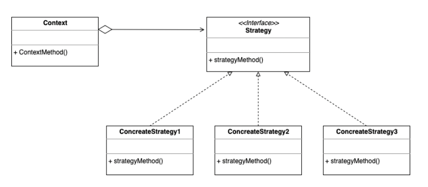
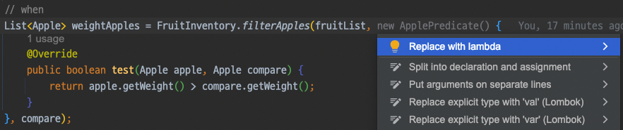

# 자바8 람다식의 등장

자바8에서 함수형 인터페이스, 람다와 같은 개념이 추가되면서 함수 객체를 더 쉽게 만들 수 있게 되었습니다.
간단한 프로그램을 기존 자바 코드로 해결하면서 발생하는 문제를 자바8에서 새롭게 추가된 개념들을 이용해 어떻게 개선할 수 있는지 비교해볼 예정입니다.

자바8에서 함수형 인터페이스, 람다와 같은 개념이 추가되면서 함수 객체를 더 쉽게 만들 수 있게 되었습니다.
간단한 프로그램을 기존 자바 코드로 해결하면서 발생하는 문제를 자바8에서 새롭게 추가된 개념들을 이용해 어떻게 개선할 수 있는지 비교해볼 예정입니다.

## 예제
### 1. 과일 재고 프로그램
과일 재고 목록을 관리하는 애플리케이션을 만들어보겠습니다.
최초 요구사항은 "녹색 사과를 모두 찾고싶다" 입니다. 코드는 다음과 같습니다.
```java
public static List<Apple> filterGreenApples(List<Apple> inventory) {
    List<Apple> result = new ArrayList<>();

    for (Apple apple : inventory) {
        if ("green".equals(apple.getColor())) {
            result.add(apple);
        }
    }

    return result;
}
```
여기서 "빨간 사과도 찾고싶다" 라는 요구사항이 추가되어서 색깔에 따라 사과를 구분하는 조건으로 코드를 수정해보겠습니다.
```java
public static List<Apple> filterApplesByColor(List<Apple> inventory, String color) {
    List<Apple> result = new ArrayList<>();

    for (Apple apple : inventory) {
        if (apple.getColor().equals(color)) {
            result.add(apple);
        }
    }

    return result;
}
```
여기서 "특정 무게와 관계없이 빨간 사과를 찾고 싶다" or "특정색깔과 관계없이 150g이 넘는 사과를 찾고 싶다" 등등의 조건으로 확장될 수도 있다고 한다면..?
필터 조건을 무게로 할지, 색깔로 할지도 정하고, 그에 따른 파라미터값들도 각각 필요할 것입니다.
```java
public static List<Apple> filterApples(List<Apple> inventory, String color, int weight, boolean useColor) {
    List<Apple> result = new ArrayList<>();

    for (Apple apple : inventory) {

    if ((useColor && apple.getColor().equals(color))
        || (!useColor && apple.getWeight() > weight)) {

            result.add(apple);
        }
    }

    return result;
}
```
위 코드는 아무래도 좋은 코드같아 보이지 않습니다.
만약 사과의 크기, 가격, 모양 등등 더 많은 조건들이 추가되어서 요구사항이 변경된다면 유연하게 대처하기 어렵습니다.

#### 전략 패턴 도입 (feat.익명 클래스)
위 코드에서 변경가능 대상은 조건절(`if()`) 입니다.
결국 이 조건절 안의 내용들을 파라미터로 받아서 처리할 수 있다면 이 같은 변경 사항에 모두 유연하게 대처할 수 있습니다.

원하는 것은 동적으로 `boolean`을 반환하는 함수입니다.
이 부분을 인터페이스를 활용해 추상화하여 표현해보겠습니다.
```java
public interface ApplePredicate {
    boolean test(Apple apple, Apple compare);
}
```
```java
public static List<Apple> filterApples(List<Apple> inventory, ApplePredicate applePredicate, Apple compare) {
    List<Apple> result = new ArrayList<>();

    for (Apple apple : inventory) {

        if (applePredicate.test(apple, compare)) {
            result.add(apple);
        }
    }

    return result;
}
```
사용자가 원하는 기준에 따라 `ApplePredicate` 객체를 넘겨 필터 조건에 사용할 수 있게 되었습니다.
이젠 어떤 조건이 오더라도 `ApplePredicate` 구현체를 생성해서 필터 조건을 만들어 넘겨주기만 하면 됩니다.
구현체를 일반 클래스로 작정해도 되지만 그러면 매번 조건이 추가될때마다 클래스를 계속해서 구현해야합니다.
불필요한 코드를 줄이기 위해 **익명 클래스**를 사용해보겠습니다.
```java
@Test
@DisplayName("filterApples 테스트")
void test() {
    // given
    List<Apple> fruitList = new ArrayList<>();
    fruitList.add(Apple.builder()
            .color("red")
            .weight(160)
            .build());
    fruitList.add(Apple.builder()
            .color("green")
            .weight(100)
            .build());
    fruitList.add(Apple.builder()
            .color("green")
            .weight(160)
            .build());
    
    Apple compare = Apple.builder()
            .weight(150)
            .build();
    // when
    List<Apple> weightApples = FruitInventory.filterApples(fruitList, new ApplePredicate() {
        @Override
        public boolean test(Apple apple, Apple compare) {
            return apple.getWeight() > compare.getWeight();
        }
    }, compare);
    // then
    Assertions.assertThat(weightApples.size()).isEqualTo(2);
}
```
이와 같이 특정 메소드 코드 (알고리즘 혹은 전략)을 캡슐화하여 런타임에 원하는 전략을 선택하도록 하는 것을 **전략패턴**이라고 합니다.
기존에 문제가 되었던 유연하지 못한 필터 조건의 문제가 해결된 것입니다.
> **전략패턴**   
> 같은 문제를 해결하는 여러 알고리즘이 클래스별로 캡슐화되어 있고 이들이 필요할 때 교체할 수 있도록 함으로써 동일한 문제를 다른 알고리즘으로 해결할 수 있게 하는 디자인 패턴
> 

#### 자바8의 람다식

익명클래스를 사용해 프로그래밍하면 IntelliJ 에서`lambda`를 사용하라고 권장하는 모습입니다.
익명 클래스 방식은 코드가 너무 길기 때문에 자바는 함수형 프로그래밍에 적합하지 않았습니다.  
하지만 자바8에 와서 추상 메서드 하나짜리 인터페이스는 특별한 의미를 인정받아 특별한 대우를 받게 되었습니다.
지금은 **함수형 인터페이스**라 부르는 이 인터페이스들의 인스턴스를 람다식(lambda expression, 혹은 짧게 lambda)을 사용해 만들 수 있게 되었습니다.
> 람다식([JLS, 17.7](https://docs.oracle.com/javase/specs/jls/se10/html/jls-15.html#jls-15.27)) = 익명 클래스의 인스턴스(구현체)

과일 재고 프로그램으로 돌아와보겠습니다. 이 프로그램에서 결국 변형되는 코드는 한줄입니다.
이 한줄의 코드만 메소드의 파라미터로 넘기고 싶은데 가능할까요?
```java
apple.getWeight() > compare.getWeight()
```
`lambda`를 사용하면 원하는대로 할 수 있습니다.
```java
List<Apple> weightApples = FruitInventory.filterApples(fruitList,
        (apple, compare1) -> apple.getWeight() > compare1.getWeight(),
        compare);
```
**apple과 compare를 파라미터로 사용하여 비교하는 코드**가 파라미터로 전달되었습니다. 코드가 더 간결해졌습니다.
여기서 신기한 점은 매개변수 (apple, compare)의 타입은 **Apple**, 반환값의 타입은 **boolean**이지만 코드에는 언급이 없습니다.
컴파일러가 문맥을 살펴 타입을 추론해준 것입니다. 상황에 따라 컴파일러가 타입을 결정하지 못할 수도 있는데, 그럴 때는 프로그래머가 직접 명시해야 합니다.

그러나, 타입을 명시해야 코드가 더 명확할 때만 제외하고는, 람다의 모든 매개변수 타입은 생략하는 것이 좋습니다.
그런 다음 컴파일러가 "타입을 알 수 없다"는 오류를 낼 때만 해당 타입을 명시하는 것도 방법입니다.

#### 조금 더 자바8스럽게 해결하기
이번에 좀 더 개선해볼 코드는 기존에 `ApplePredicate`를 호출했던 매서드입니다.
```java
public static List<Apple> filterApples(List<Apple> inventory, Applepredicate applePredicate, Apple compare) {
    List<Apple> result = new ArrayList<>();
    
    for (Apple apple : inventory) {
        if(predicate.test(apple)) {
            result.add(apple);
        }
    }
    
    return result;
}

```
위 코드는 빈 리스트를 생성하고 조건에 맞는 값을 찾아 만든 리스트에 넣은 다음 그 리스트를 반환하고 있습니다.
이렇게 하지 않고 `inventory`에 필터를 걸어 값을 걸러내기만 할 수는 없을까요?

자바8에선 이런 코드를 데이터 원소의 처리를 라이브러리 차원에서 지원하는  **스트림 API**를 이용해 쉽게 해결할 수 있습니다.
```java
return inventory.stream()
        .filter(apple -> apple.getWeight() > compare.getWeight())
        .collect(Collectors.toList());
```
별도로 리스트를 생성할 필요도, 리스트에 결과값을 다시 추가할 필요도 없어졌습니다.

추가로, 메서드 선언부도 **표준 함수형 인터페이스**를 사용해 변경할 수 있습니다.
조건식을 함수로 표현하는데 사용되는 `BiPredicate<T,U>`를 사용한 코드는 다음과 같습니다.
(매개변수의 개수가 2개인 함수형 인터페이스는 이름 앞에 접두사 `Bi`가 붙습니다.)
```java
public static List<Apple> filterApples(List<Apple> inventory, BiPredicate<Apple, Apple> applePredicate, Apple compare) {
    ...
}
```
> **표준 함수형 인터페이스**  
> java.util.function 패키지에 일반적으로 자주 쓰이는 형식의 메서드를 함수형 인터페이스로 미리 정의해 놓았습니다.
> 그래야 함수형 인터페이스에 정의된 메서드 이름도 통일되고, 재사용성이나 유지보수 측면에서 장점을 가져갈 수 있습니다.

### 2. 사칙연산 Enum
```java
public enum Operation {
    PLUS("+") {
        public double apply(double x, double y) { return x + y; }
    },
    MINUS("-") {
        public double apply(double x, double y) { return x - y; }
    },
    TIMES("*") {
        public double apply(double x, double y) { return x * y; }
    },
    DIVIDE("/") {
        public double apply(double x, double y) { return x / y; }
    };

    private final String symbol;

    Operation(String symbol) { this.symbol = symbol; }

    @Override
    public String toString() { return symbol; }

    public abstract double apply(double x, double y);
}
```
코드를 보면 바로 알겠지만 "사칙연산"이라는 `책임`을 가지고 있는 `Enum`입니다.
**apply** 메서드의 동작이 상수마다 달라야 해서 상수별 클래스 몸체를 사용해 각 상수에서 추상 메서드인 **apply** 메서드를 재정의한 코드입니다.
단순히 사칙연산의 상태(+,-,*,/)만 가지고 있는 것이 아니라 상태에 따른 행위(로직)도 같이 가지고 있으므로 충분히 객체지향적입니다.
다만 상수별 클래스 몸체를 구현하는 방식보다 열거 타입에 인스턴스 필드를 두는 편이 더 낫습니다. 그런데 이 상황에서 로직을 어떻게 인스턴스 필드로 둘 수 있을까요..?
**lambda**를 활용하면 이 방식을 쉽게 구현할 수 있습니다.

### 자바 8의 람다식
```java
public enum Operation {
    PLUS("+", (x, y) -> x + y),
    MINUS("-", (x, y) -> x - y),
    TIMES("*", (x, y) -> x * y),
    DIVIDE("/", (x, y) -> x / y);

    private final String symbol;
    private final DoubleBinaryOperator op;

    Operation(String symbol, DoubleBinaryOperator op) {
        this.symbol = symbol;
        this.op = op;
    }

    @Override
    public String toString() { return symbol; }

    public double apply(double x, double y) {
        return op.applyAsDouble(x, y);
    }
}
```
단순히 각 열거 타입 상수의 동작을 람다로 구현해 생성자에 넘기고, 생성자는 이 람다를 인스턴스 필드로 저장해둡니다.
그런 다음 **apply** 메서드에서 필드에 저장된 **lambda**를 호출하기만 하면 됩니다. 원래 버전보다 훨씬 깔끔해졌습니다.
(`DoubleBinaryOperator` 인터페이스는 앞서 언급한 표준 함수형 인터페이스 중 하나입니다.)

### 마무리
이펙티브 자바의 내용을 빌려 말하자면 람다의 시대가 열리면서 익명클래스는 설 자리가 크게 좁아졌습니다. 그러나 람다로 대체할 수 없는 곳이 있습니다.
람다는 **함수형 인터페이스**에서만 쓰입니다. 예컨데 추상 클래스의 인스턴스를 만들 때 람다를 쓸 수 없으니 익명 클래스를 써야 합니다.

자바8에서 람다와 함께 추가된 개념인 메서드 참조, 스트림 API와 같은 개념들도 이제는 실무에서 굉장히 많이 쓰이는 것 같습니다.
다음 포스팅에선 람다 사용시 주의할 점과 같은 내용을 다루며 람다를 좀 더 깊게 공부해보는 시간을 가져보겠습니다.