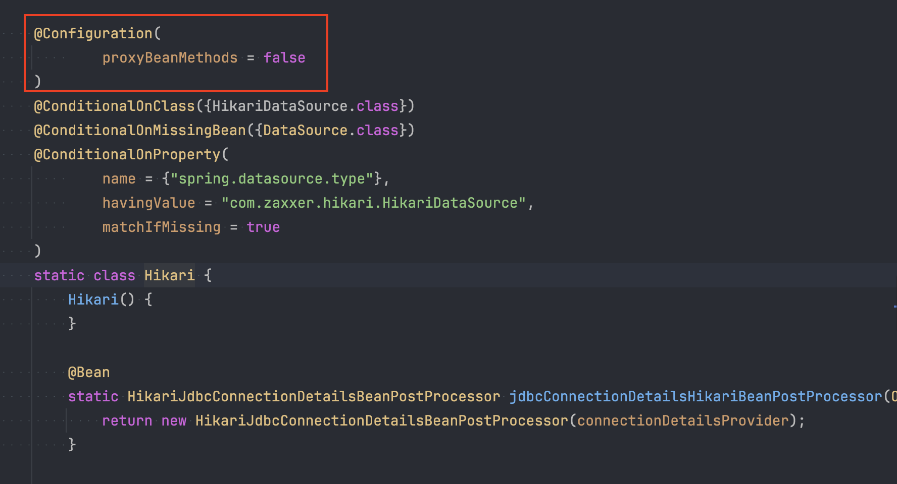

## 자바 코드로 빈 등록하기
스프링 `@Configuration` 클래스의 `@Bean` 메서드를 활용하여 **자바코드로 빈 등록**을 할 수 있다. 아래 학습 테스트 코드를 살펴보자

```java
class ConfigurationTest {
    
    @Test
    void configuration() {
        AnnotationConfigApplicationContext ac = new AnnotationConfigApplicationContext();
        ac.register(MyConfig.class);
        ac.refresh();

        BeanA bean1 = ac.getBean(Bean1.class);
        BeanB bean2 = ac.getBean(Bean2.class);

        Assertions.assertThat(bean1.item).isSameAs(bean2.item); // isSameAS: 메모리상 같은 객체를 가리키는지 비교 (주소 비교) 
    }

    @Configuration
    static class MyConfig {
        @Bean
        Item item() {
            return new Item();
        }

        @Bean
        Bean1 bean1() {
            return new Bean1(item());
        }

        @Bean
        Bean2 bean2() {
            return new Bean2(item());
        }
    }

    static class Bean1 {
        private final Item item;

        Bean1(Item item) {
            this.item = item;
        }
    }

    static class Bean2 {
        private final Item item;

        Bean2(Item item) {
            this.item = item;
        }
    }

    static class Item {
    }
    
    
}
```
@Bean이 붙은 bean1() 메서드와 bean2() 메서드에서 스프링 컨테이너가 얻을 수 있는 정보는 빈 클래스의 종류와 빈의 이름뿐이다. 나머지 설정 메타정보는 모두 디폴트 값이 적용된다는 의미이다. 빈의 스코프 디폴트 값은 **싱글톤**이다. 따라서 Item 오브젝트의 싱글톤 여부를 확인하는 위 테스트 코드는 성공한다. 

그런데 코드를 보면 굉장히 의아한 점이 있다. item()이란 이름의 팩토리 메서드를 호출해서 Item 타입의 오브젝트를 가져온 다음에 Bean1과 Bean2 오브젝트를 생성할 때 사용하고 있다. 그러면 각 Bean을 생성하는 bean1() 메서드와 bean2() 메서드가 각각 실행되면 이 item() 이란 메서드는 두 번 실행이 된 것이다. 즉, 평범한 자바코드로 생각하면 생성된 두 인스턴스의 메모리 주소는 다를 것이다. 그런데 어떻게 해당 오브젝트가 싱글톤으로 유지 될 수 있을까?

## @Configuration의 작동원리
@Configuration이 붙은 클래스는 `CGLIB 라이브러리`를 이용해서 프록시 클래스로 확장을 해서 **@Bean이 붙은 메서드의 동작방식을 변경**한다. 위 테스트 코드에서 @Configuraiton 부분을 주석처리하고 돌려보면 테스트가 실패한다.

> CGLIB(Code Generator Library): 코드 생성 라이브러리로서 런타임에 동적으로 자바 클래스의 프록시를 생성해주는 기능을 제공한다. CGLIB는 타겟에 대한 정보를 직접적으로 제공 받아 바이트 코드를 조작하여 프록시를 생성한다.

CGLIB 의 내부 동작 원리를 표현한 테스트 코드를 살펴보자
```java
@Test
void proxyConfiguration() {
    MyConfigProxy myConfigProxy = new MyConfigProxy();

    Bean1 bean1 = myConfigProxy.bean1();
    Bean2 bean2 = myConfigProxy.bean2();

    Assertions.assertThat(bean1.item).isSameAs(bean2.item);
}

static class MyConfigProxy extends MyConfig {
    private Item item;

    @Override
    Item item() {
        if (this.item == null) this.item = super.item();

        return this.item;
    }
}
```

`MyConfigProxy`가 바로 CGLIB가 기존 클래스를 확장하여 생성한 프록시 클래스를 간략하게 나타낸 것이다. 한 번 호출된 Item 오브젝트를 변수로 캐싱하여 가지고 있다가 다시 호출되면 기존에 생성된 Item 오브젝트를 반환한다. 이 원리로 오브젝트의 싱글톤을 유지할 수 있는 것이다. 여기까지가 @Configuraiton의 동작 원리다. 

그런데 만약 이 경우처럼 **@Bean 메서드 직접 호출로 빈 의존관계 주입을 하는 케이스**가 없다면 굳이 복잡한 프록시 생성을 하지 않아도 되지 않을까?

## proxyBeanMethods 옵션
proxyBeanMethods는 @Configuration의 옵션으로 기본값은 프록시를 생성하는 true 이다. 스프링 5.2부터 지원되기 시작했고 지금은 스프링과 스프링 부트의 상당히 많은 @Configuraiton 설정에 사용되고 있다. 예시로 유명한 클래스 몇 개를 첨부했다. (스프링 부트 3.x 기준)

##### Hikari


##### JacksonConfiguration


해당 **옵션을 false로 주면 @Configuration 클래스의 프록시 클래스를 생성하지 않는다.** 본문의 학습 테스트코드에서 해당 옵션을 false 로 주고 테스트하면 당연히 테스트 코드가 실패할 것이다.
이러한 빈 등록방식은 **@Bean의 라이트 모드(light mode)**라고도 부르고 @Configuraiton 대신 @Component 를 사용해도 동일하게 동작한다. 다만 개인적으로는 빈 설정 클래스라는 의미를 부여하는 차원에서 @Configuraiton 을 사용하는 것을 권장한다.

하지만 보통의 경우 애플리케이션을 구동할때 빈을 한번 생성하면 되므로 성능을 위해 해당 옵션을 사용가능한 순간마다 false로 넣는 것을 타이트하게 강제할 필요는 없어 보인다. 그러나 이제 스프링과 스프링 부트에서 잘 사용하는 옵션이라고 하니 어떠한 기능을 하는지 잘 알고 적절한 상황에 사용하면 좋을 것 같다.
